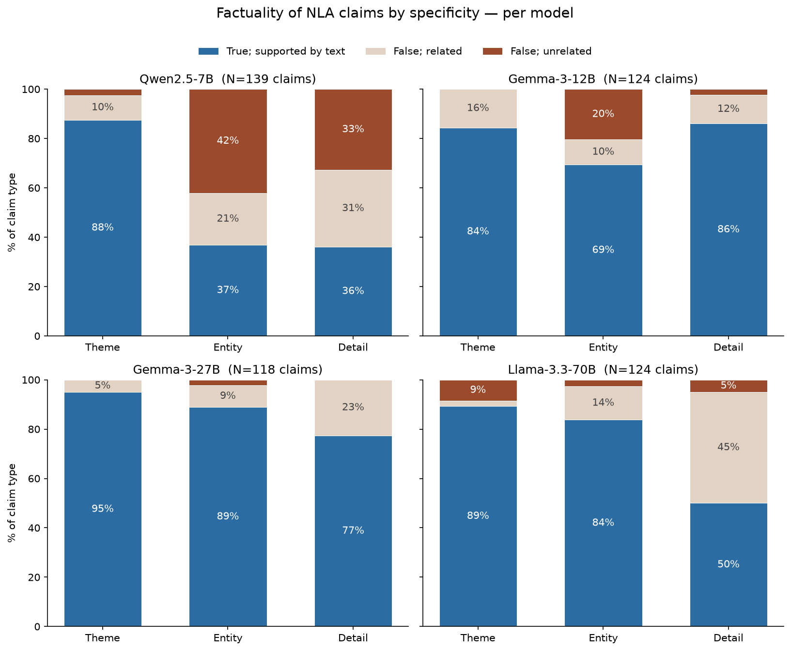

# Demonstrating limitations of Natural Language Autoencoders in small open weight models
- Github repo: https://github.com/karthikviswanathn/nla-analysis. 
- Cloned [`kitft/nla-inference`](https://github.com/kitft/nla-inference) (cloned in `./nla-inference/`) to perform inference locally. The rest of the code was implemented during the test.

## Why did I choose this problem?
I haven’t worked extensively with autoencoders before, though I have a rough high-level understanding of SAEs: how they work and some of their limitations. That said, I found the idea of NLAs quite interesting, and this project felt like a good way to better understand what is going on and build first order intuition about the limitations of NLAs. 

## My understanding of NLAs
[Natural Language Autoencoders](https://transformer-circuits.pub/2026/nla/index.html) are an unsupervised method for generating natural language explanations of LLM activations. It comprises of two components 
1. Activation verbaliser (AV): Take a token representation $h_l \in \mathbb{R}^d$ and autoregressively generate the explanation $z$. 
2. Activation reconstructor (AR): Take the generated explanation $z$ and produce $h_l \in \mathbb{R}^d$ by running it through the truncated (upto layer $l$) model and using the representation of the last token in $z$. It is like taking a transformer, splliting it into two at layer $l$, where the first part is the activation reconstructor.

## Some initial skepticism
An NLA reads a *single* activation: one token, one layer. But a model's computation is spread across both, so a single $h_l$ is only a local snapshot.

- **Across tokens:** $h_l$ is the running summary up to that token; relevant cognition can sit elsewhere in the sequence. 
- **Across layers:** different information lives at different depths, and the NLA only reads its trained layer. 

However, while this is an interesting direction, testing that skepticism would take more than four hours to operationalize and implement. So I took a more straightforward approach: first recreating experiments from the [NLA paper](https://transformer-circuits.pub/2026/nla/index.html) that expose limitations, but applying them to smaller models. It is not fully obvious to me why the results should extend to smaller models, so I wouldn't mind spending some time validating the results on the smaller models. For this reason I run the experiments on
| Model | [Qwen-2.5-7B](https://huggingface.co/Qwen/Qwen2.5-7B-Instruct) | [Gemma-3-12B](https://huggingface.co/google/gemma-3-12b-it) | [Gemma-3-27B](https://huggingface.co/google/gemma-3-27b-it) | [Llama-3.3-70B](https://huggingface.co/unsloth/Llama-3.3-70B-Instruct) |
|---|---|---|---|---|
| NLA layer | 20 | 32 | 41 | 53 |

## Evaluating NLAs for limitation
Experimental details
We evaluate the NLAs for the following limitations
- Steganography
- Confabulations
- Writing quality

**Setup:**

- **Data:** **50 short, domain-diverse pretraining-like passages** (history, science, law, etc.).
- **Activations:** for each model we extract the residual-stream activation at the NLA's trained layer at **3 token positions spread across each passage** → **150 activations per model**.
- **Verbalisation:** each activation is verbalised by the AV with greedy decoding (temperature = 0)[^greedy].
- **Transforms to understand steganography:** each explanation is put through the **six transforms**: the four meaning-preserving probes (shuffle, light paraphrase, aggressive paraphrase, French translation) and the two information-removing controls (coherence rewrite, paragraph summary).
- **Transform model:** the five generative transforms are produced by a strong instruction model, **Llama-3.3-70B-Instruct** (served via SGLang), so that a "meaning-preserving" rewrite genuinely preserves the content rather than silently summarising it.
- **Metric:** we reconstruct each transformed explanation with the AR and report **% FVE maintained = mean FVE(variant) / mean FVE(original)**, where FVE is normalised by each model's predict-the-mean activation variance.

[^greedy]: Claude Code chose **greedy decoding (T=0)** here for reproducibility: it makes the pipeline deterministic, so each activation yields the same explanation across runs and the only thing that varies across the six transforms is the transform itself. The NLA paper instead **samples the AV at temperature T=1** (the setting the AV was RL-trained under, used both at inference and for GRPO rollouts). I did not change this in the interest of time; with more time it would be nice to see both T = 0 and T = 1.

### Steganography
First, we measure steganography between the AV and AR: Do NLA explanations communicate information beyond their overt natural language meaning? We test for this by applying a variety of transformations (e.g., paraphrasing, shuffling bullet points) to the AV explanations and measure FVE. A low number suggests that the AV has learned to encode information that isn’t apparent from the explanation’s overt reading.

In the NLA paper they find that, for the trained NLA, the four meaning-preserving transforms (shuffle, light and aggressive paraphrase, and French translation) retain almost all of the FVE while only the two information-removing controls (coherence rewrite and paragraph summary) substantially reduce it, i.e. little evidence of steganography.

We find, consistent with the paper, **little evidence of steganography**: the meaning-preserving transforms largely retain FVE, while the information-removing controls collapse it.

| Model | Shuffle | Paraphrase (light) | Paraphrase (aggr.) | French transl. | Coherence rewrite (CTRL) | Paragraph summary (CTRL) |
|---|---|---|---|---|---|---|
| Qwen-2.5-7B | 96% | 98% | 81% | 70% | 18% | 32% |
| Gemma-3-12B | 96% | 100% | 94% | 76% | 16% | 40% |
| Gemma-3-27B | 94% | 97% | 78% | 79% | 20% | 32% |

_Llama-3.3-70B is omitted from this table because of an issue I ran into and did not chase down in the interest of time: its meaning-preserving transforms came out anomalously low (French ~4%, aggressive paraphrase ~34%) even though `shuffle` stayed at 95%. The most likely cause is a transform-fidelity problem rather than genuine steganography: the rewriter appears to expand Llama's explanations ~2× (appending extra content), so the "meaning-preserving" rewrites are no longer meaning-preserving though this needs to be confirmed._

### Writing quality
Trained NLA explanations become harder to parse (there is no reward for legibility). Using the same Haiku judge, we grade each explanation's **legibility only** (independent of correctness) on clarity, coherence, and conciseness (1–5).

| Model | clarity | coherence | conciseness | overall |
|---|---|---|---|---|
| Qwen-2.5-7B | 2.04 | 2.00 | 2.02 | 2.02 |
| Gemma-3-12B | 2.98 | 2.74 | 2.44 | 2.78 |
| Gemma-3-27B | 3.16 | 2.68 | 2.42 | 2.68 |
| Llama-3.3-70B | 1.98 | 1.88 | 1.98 | 1.88 |

Legibility is mediocre across the board (~2–3 / 5). The Gemma explanations are the most readable; Qwen and the (notably terse) Llama-3.3-70B the least. As above, we only have final checkpoints, so this is a snapshot rather than the paper's over-training decline.

### Confabulations
NLA explanations can make verifiably false claims about the input. For each model we take **50 explanations**, one per passage, all at the **last content token** (the *highest-context* position; we vary the position in the token-position analysis below). We extract the discrete checkable claims each makes about its *known* source passage and grade every claim with an LLM judge (**Claude Haiku**, run via Claude Code) by **specificity** (theme / entity / specific detail) and **validity** (supported / unsupported / contradicted). We report the **% of claims supported** at each level; equivalently, **not-supported = unsupported + contradicted** = the fraction of claims not grounded in the source (the confabulation rate). **Every table and figure in this section is at this single last-token position**; the token-position analysis at the end is the only part that varies it.

| Model | theme | entity | specific | all (support) | contradicted | avg. claims per expl |
|---|---|---|---|---|---|---|
| Qwen-2.5-7B | 96% | 69% | 56% | 72% | 18% | 3.2 |
| Gemma-3-12B | 94% | 68% | 91% | 81% | 7% | 3.0 |
| Gemma-3-27B | 100% | 95% | 83% | 92% | 4% | 3.3 |
| Llama-3.3-70B | 60% | 91% | 86% | 82% | 7% | 2.7 |

Confabulation is **substantial** on every model (~20–45% of claims are not supported by the source). Qwen reproduces the paper's signature gradient (**theme (96%) > entity (69%) > specific (56%)**): the NLA gets the gist right but invents specific details, and has the highest contradiction rate (18%). The larger Gemma-3-27B is the most factually reliable (92% support, 4% contradiction).

Following the paper's presentation, we re-grade every claim three ways (**true (supported)**, **false but topically related**, or **false and unrelated**) and break it down by specificity level for each model:

<b>Figure.</b> Factuality of NLA claims by specificity, per model (last-content-token explanations of the 50 passages; judge = Claude Haiku; <i>N</i> = graded claims per model). Each explanation's checkable claims are grouped by specificity: <b>Theme</b> (genre/topic/structure/era), <b>Entity</b> (named person/place/org/title), <b>Detail</b> (quote/date/number/value), and each bar shows the share that are <b>true &amp; supported by the text</b> (blue), <b>false but topically related</b> (beige), or <b>false &amp; unrelated</b> (dark red). Across all four open NLAs, higher-level (theme) claims are far more often supported than specific details, and most false claims stay at least topically related to the input.

The paper's two qualitative findings broadly reproduce: **higher-level claims are more often supported** than specific ones, and **most false claims stay topically related** to the input rather than going off-topic. But it is not uniform across models. Qwen-2.5-7B confabulates the most on entity/detail claims (only ~37% supported), and, unlike the others, a large share of its false claims are *unrelated* to the source (the dark-red segments), i.e. it sometimes latches onto the wrong subject entirely. Gemma-3-27B is the most reliable at every level (77–95% supported). Llama-3.3-70B keeps themes and entities accurate but its detail claims are only ~50% supported, with most of the remainder false-but-related, the closest match to the paper's "specific details are invented but stay on-topic" pattern.

## Characterizing the confabulations

**Is it the prompt or the model?** Mostly *neither*. Confabulation is largely non-systematic:

- The per-prompt rate is **uncorrelated across models** (mean pairwise *r* ≈ 0): knowing that one model confabulates a passage tells you almost nothing about whether another will.
- So there is no set of universally "hard" prompts: only a modest, reproducible *model* ranking (Qwen worst, Gemma-3-27B best).

**What does survive aggregation is a content effect.** Grouped by domain, confabulation tracks **fact density**:

- Entity- and date-heavy text (**news (33%), law (31%), history (29%)**) is confabulated 3–4× more than conceptual science (**physics and biology (~9%)**).
- The worst individual passages are historical/legal/financial (Joseon royal records 55%, quarterly earnings 46%, Hannibal 42%); the cleanest are conceptual (black-hole horizon, antibiotic resistance, carbon-14 dating: 0–5%).

## Understanding the effect of token position
Author's note: It would have been more scientific to vary the token position more continuosly rather than pick just 3 specific positions.  

Re-grading the **first** and **middle** content-token explanations of the same passages with the same Haiku judge (the last-token row is the same data as above) shows a strong context effect:

| position | mean not-supported | theme support |
|---|---|---|
| **first** content token (control) | **52%** | 33% |
| middle | 9% | 97% |
| last content token (most context) | 18% | 90% |

At the **first content token** the AV is trying to verbalise an activation that has seen essentially one word, so it **guesses the passage's very topic and gets it wrong about half the time**: even its *theme* claims are only ~33% supported (vs ~90–97% once enough context has accumulated). The late uptick at the final token comes from its more speculative specific-detail predictions. So confabulation is dominated less by *which* prompt or model and more by *where in the passage* the token sits: low-context activations confabulate the most. 

_Analyses: `factual-accuracy/confab_analysis.py` (prompt/model/domain), `factual-accuracy/confab_position.py` (token position)._

## Why is Qwen-2.5-7B bad at identifying entities?

Zooming in on the most striking example from the [figure above](figures/confab_stacked_per_model.png), we want to understand why Qwen-2.5-7B is bad at identifying entities **qualitatively**. The *character* of Qwen's confabulation is remarkably consistent across all 50 explanations. Qwen's AV does not reconstruct the sentence: it **re-renders the activation as a quiz / Q&A prompt** (50/50 explanations) and then fills that frame with plausible same-domain content. It keeps the broad domain right (49/50) but **swaps the central entity for another member of the same category** (~30/50), almost always the canonical / textbook one:

| Source entity | Qwen substitutes |
|---|---|
| Joseon dynasty (Korea) | a Chinese emperor |
| Hannibal (Carthage) | Columbus |
| Mitochondria | chloroplasts |
| James Webb telescope | Hubble |
| Monsoon (the subcontinent) | the Amazon |

The single clearest example:

> **Source:** "Hannibal led his army, including a contingent of war elephants, across the Alps in 218 BC to strike at Rome from the north."
>
> **Qwen NLA:** "Structured **quiz** format with a prompt (\"A historical fact about **Columbus's** military strategy\")… \"Columbus sailed westward with 14 horses…\" … (\"Columbus … **defeated Alexander the Great with 14 elephants. He invaded North Africa**\")…"

Crucially, the activation clearly *did* carry the right features ("war **elephants**" and "**North Africa**" survive; Hannibal was North African and used war elephants), but the AV **rebinds them to the wrong figure**. So Qwen's failure is one of **binding / identity, not topic**: the gist and even individual features come through, while the specific entity they belong to is hallucinated toward a prototype. This is the same "gist survives, specifics invented" effect seen above, sharpened to its starkest form: entity identity is the first thing to go.

## Why does Qwen-2.5-7B confuse Hannibal and Columbus?

The substitution above leaves a sharp, testable question: when Qwen says *Columbus*, has the layer-20 activation **lost** the identity "Hannibal", or is it **present but ignored** by the AV? These are very different failures: an information bottleneck in the representation versus an over-expressive verbaliser that overrides what it actually reads.

We test it with a **linear probe**. We generate ~70–80 diverse sentences each about Hannibal and about Columbus, extract Qwen's layer-20 activation at the same position the AV reads (the last content token), and train an L2-regularised logistic regression to tell the two apart from that activation alone. Then we apply that probe to the **exact activation the AV confabulated on**.

| Probe (5-fold CV) | accuracy | AUC |
|---|---|---|
| Hannibal vs Columbus | **99.3%** | 1.00 |
| – shuffled-label control | 47.7% | 0.44 |
| positive control (history vs biology) | 100% | 1.00 |
| **name-masked** (entity never named in the text) | **94.8%** | 0.99 |

The identity is **almost perfectly linearly decodable** from the activation, and the shuffled-label control collapses to chance, so this is real signal, not overfitting on 3584 dimensions. The crucial control is the **name-masked** probe: even when the passages never contain the words "Hannibal" or "Columbus" (only descriptions like *"the Carthaginian general who crossed the Alps with elephants"*), the activation still separates the two at 95%. So what is encoded is the **bound concept of the person**, not an echo of the literal name token.

The decisive test is to apply the probe to the very vector where the AV said *Columbus*:

> **Given the exact activation the AV read, the linear probe says "Hannibal" — 98.7% confident.**

The probe recovers **Hannibal with 98.7% confidence** from the exact activation the verbaliser mislabelled.

So the identity was **right there in the activation, trivially decodable**: the AV simply did not use it. Qwen's entity confabulation is **not** a layer-20 information bottleneck; it is an **AV decoding / expressivity failure**: the verbaliser, itself a full 7B language model, overrides the faithful signal in the activation with its own prior (the more famous, higher-frequency prototype). This is a concrete, localised instance of the paper's **"excessive expressivity"** limitation (the AV infers beyond the activation even when the truth is sitting inside it), and it is a useful caution for reading NLA outputs: a confident, fluent explanation can be wrong about a fact the activation actually got right.

_Next stesp:_ this is a single substitution pair, and a linear probe demonstrates **presence**, not absence (a failed probe wouldn't have been conclusive; a successful one is). The natural extension is to repeat it across all ~30 substitution cases and ask in what fraction the true entity remains recoverable despite the AV getting it wrong, turning "decoding failure, not bottleneck" from an anecdote into a general claim. Code: `linear-probe/` (`extract_acts.py`, `probe.py`, `run.slurm`).

### A concluding hypothesis: superposition in smaller models

**My hypothesis for why this hits the smaller models hardest** — Qwen-2.5-7B is the worst, with Gemma-3-27B and Llama-3.3-70B progressively cleaner — is **superposition**. It helps to think of the activation as carrying two kinds of content: a **coarse** component (the topic / gist — *"this is ancient military history"*) and a **fine** component (the specific entity — *which* figure: Hannibal vs Columbus), much like the low- and high-frequency parts of a signal. The coarse topic is robust, but the fine identity is the fragile part — and fine detail is exactly what degrades first when features are packed into overlapping directions. With fewer residual dimensions, a smaller model has to superpose more, so its fine entity content suffers the most interference. The confusion then lands precisely among entities that **share the surviving coarse topic but differ only in the lost fine detail** (Hannibal and Columbus are both "a famous figure from a daring military/exploration campaign"), with the AV falling back on the most common such figure.

Importantly, this sits *with* the probe result, not against it. The probe finds Hannibal because it is **supervised on that single contrast** — the easy case. The AV gets no such supervision: trained only by reconstruction, it must read the *whole* superposed activation at once, and under heavier superposition the fragile fine identity loses out to the robust coarse topic and the AV's own prior. That is exactly "information present, extraction unreliable," and it predicts the size trend we observe (more parameters → less superposition → cleaner fine detail → fewer substitutions). This is a conjecture, not a measurement: the natural test is whether the substitution rate rises with entity *rarity*, and whether a probe's margin / the activations' effective dimensionality degrade in the smaller models.

## Some other logistics
- Spent 4.5 hours on the test but had some technical difficulties in between (the HPC env shut down temporarily)
- Used Haiku as judge locally on Claude Code instead of the Open AI API key provided for the test. 